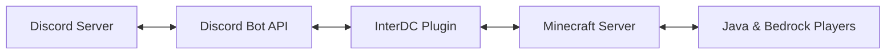

# InterDC — Discord Inside Minecraft (v1.2)

Bring your Discord server directly into Minecraft using interactive in-world screens.

InterDC integrates Discord channels into physical map panels inside the game, with Java + Bedrock support, live updates, and localized UX.

---

## Project Status

**Current version:** `1.2`  
**State:** stable for core production usage (sync, render, and main commands), with an active roadmap for advanced UX and moderation workflows.

---

## What Has Been Added (Implemented)

### Core / Integration

- In-world Discord rendering on physical Minecraft screens (ItemFrame + maps)
- Real-time sync for channels, messages, and members
- Live Discord mode (JDA) + mock fallback mode
- SQLite persistence for screens, themes, and state

### In-Game UX / Panel

- Visual style presets: `discord`, `glass`, `classic`, `ultra`
- Adaptive text contrast for better readability on light/dark backgrounds
- Optional member list panel
- Click interaction flow, including Bedrock/Geyser compatibility

### Operations / Administration

- Screen management commands (`create`, `link`, `link2`, `move`, `remove`, `reload`)
- `/dc health` diagnostics (Discord/DB/cache/coalescer/flags snapshot)
- `/dc perf` runtime performance counters
- Feature flags for internal services
- Discord event coalescing to reduce burst update pressure

### Localization

- Native support for 7 languages: EN, PT-BR, ES, FR, DE, IT, JA
- Locale fallback + optional automatic client-locale mode

---

## What Is Missing (Next Steps)

- Richer in-panel interaction actions (moderation shortcuts and advanced controls)
- More customizable visual themes per server/guild
- Broader automated test coverage for render and interaction flows
- Better operational observability docs and ready-to-use dashboards
- Improved onboarding/setup wizard for Discord token and permissions

---

## How It Works

Messages, channels, and avatars are synchronized through the Discord API and rendered onto Minecraft map screens.

---

## Commands

### Aliases

- `/dc`
- `/interdc`

### Main Commands

- `/dc create <width> <height>` — create a new screen
- `/dc link <channelId> [guildId]` — link primary channel
- `/dc link2 <channelId> [guildId]` — link secondary channel
- `/dc style [discord|glass|ultra|classic]` — change visual style
- `/dc health` — show system health snapshot
- `/dc perf` — show performance/render stats
- `/dc lockchannel on|off` — lock/unlock active channel
- `/dc webhook <url|clear>` — set/remove webhook
- `/dc move` — move focused screen
- `/dc remove` — remove focused screen
- `/dc reload` — reload config and services
- `/dc lang <locale|auto>` — manual/automatic language

---

## Requirements

- **Paper/Purpur 1.21+**
- **Java 21**
- **Discord bot token** (live mode)
- **GeyserMC** (optional, for Bedrock)

---

## Vision

InterDC turns server hubs and lobbies into living social spaces, keeping players connected to Discord without leaving the game.
