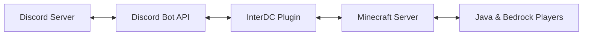

# InterDC — Discord Inside Minecraft

Bring your Discord community directly into Minecraft through interactive in-world screens.

---

## About

**InterDC** is a next-generation Minecraft plugin that connects Discord and Minecraft in a fully immersive way.

Instead of traditional chat bridges or command menus, InterDC allows staff to place physical interactive screens inside the game world. Players can view live Discord channels, messages, member activity, and updates in real time directly from server lobbies, hubs, or any custom location.

> Make Discord feel like part of the Minecraft world.

---

---

## Why InterDC

- Real in-world Discord interface rendered on Minecraft maps
- Interactive channel switching by clicking the panel
- Live sync for messages, channel/category updates, and permissions
- Built for Java + Bedrock environments (Geyser-ready)
- High-performance render/cache pipeline for smooth usage

---

## Cross-Platform & Global Support

### Full Geyser Compatibility

InterDC is designed to work with Java and Bedrock players at the same time (mobile, console, and PC), including panel interaction and compose flow.

### Native Multi-Language System

InterDC includes built-in localization and can follow the player client language automatically.

Supported languages:

- English
- Portuguese (BR)
- Spanish
- French
- German
- Italian
- Japanese

---

## Core Features

- Interactive screens placed directly in the Minecraft world
- Live Discord synchronization with real-time updates
- Touchscreen-like interaction using clickable map rendering
- Channel/category create, rename, delete auto-refresh
- Permission update auto-refresh (view/send changes)
- Optional member list panel toggle
- Channel lock mode for fixed screens
- Bedrock-friendly compose and interaction flow
- Fully vanilla compatible (no mods or resource packs required)

---

## How It Works

Messages, channels, and avatars are synchronized through Discord and rendered on in-game map tiles by the plugin renderer.

---

## Requirements

- Paper or Purpur 1.21+
- Java 21
- Discord bot token (for live mode)
- Discord permissions to read/send where needed
- GeyserMC (optional, only required for Bedrock support)

---

## Installation

1. Download or build the plugin JAR.
2. Put the JAR inside your server `plugins` folder.
3. Start the server once to generate config files.
4. Configure `plugins/InterDC/config.yml`:
   - `discord.enabled: true`
   - `discord.bot-token: "YOUR_TOKEN"`
5. Restart server (or use `/dc reload`).

---

## Quick Start

1. Stand in front of a valid wall.
2. Create a screen:
   - `/dc create 3 3`
3. Link a Discord channel:
   - `/dc link <channelId>`
4. Right-click the panel to interact and switch channels.

---

## Commands

Main command alias: `/interdc` and `/dc`

### Screen Management

- `/dc create <width> <height>` — Create a new screen
- `/dc remove` — Remove looked-at screen
- `/dc move` — Move looked-at screen to your current target
- `/dc reload` — Reload plugin config and screen renderers

### Channel Linking

- `/dc link <channelId> [guildId]` — Set primary channel
- `/dc link2 <channelId> [guildId]` — Set secondary channel
- `/dc lockchannel on|off` — Lock/unlock current active channel

### Webhook

- `/dc webhook <url>` — Set webhook for looked-at screen
- `/dc webhook clear` — Clear webhook

### Language

- `/dc lang` — Show current/effective locale
- `/dc lang <locale>` — Set manual locale override
- `/dc lang auto` — Return to automatic client locale

---

## Permission Node

- `interdc.admin` — Manage screens and admin commands (default: op)

---

## Configuration Notes

Important keys in `config.yml`:

- `messages.use-client-locale` — Make UI/messages follow player language
- `screen.interaction-distance` — Max interaction distance for panels
- `fly-assist.*` — Flight helper near large panels
- `auto-update.*` — Automatic update behavior from Modrinth

---

## Performance & Sync

InterDC includes:

- Render cache invalidation by screen and locale
- Debounced guild channel-update refresh to avoid redraw bursts
- Avatar fetch cache and failed-request cooldown
- SQLite-backed persistence for screens/theme/message storage

---

## Development

### Build

- `./gradlew build`

### Project Stack

- Kotlin (JVM)
- Paper API 1.21
- JDA 5
- SQLite JDBC
- Gradle + Shadow

---

## Troubleshooting

### Panel stays in mock/demo data

- Ensure `discord.enabled: true`
- Set valid `discord.bot-token`
- Check server logs for Discord connection errors

### Language is not changing

- Ensure `messages.use-client-locale: true`
- Use `/dc lang auto` to remove player override

### Channel clicks feel incorrect

- Verify panel size and orientation are valid
- Keep `screen.interaction-distance` within sane range

---

## Roadmap

- More visual presets/themes
- Extra moderation-focused panel views
- Richer Discord action support
- Expanded localization coverage

---

## Contributing

Contributions, suggestions, and improvements are welcome.

1. Fork the repository
2. Create your feature branch
3. Commit your changes
4. Open a Pull Request

---

## License

This project is licensed under the MIT License.
